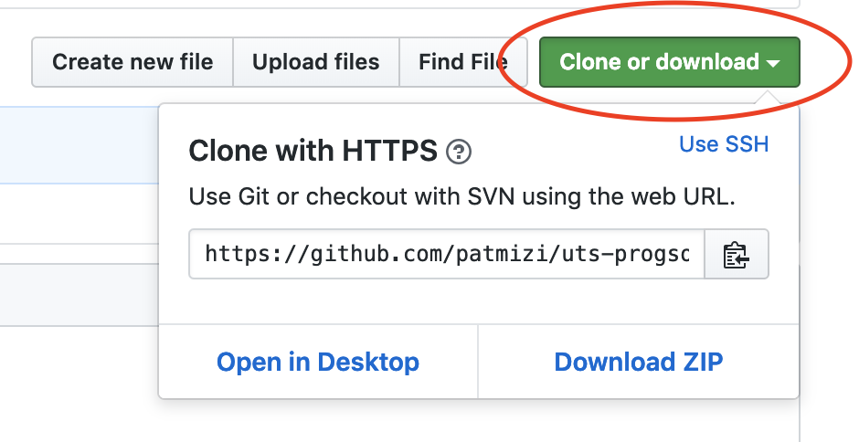
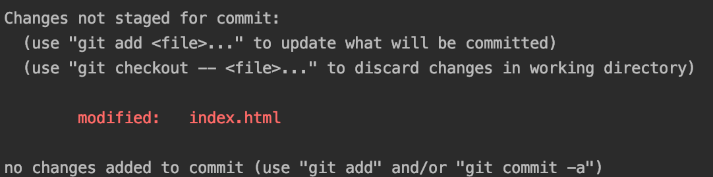

## UTS ProgSoc Git Workshop
Version control makes it possible for multiple developers to work on a file at the same time.

**What is a branch?**  
Creating your own "branch" is like taking a copy of `master` and renaming it. When you commit, the changes that you make will only exist on that branch. As you work on a GitHub repo, the first branch you are on is the default branch, called `master`. 

## Git Basics

Next please fork this repository.


### Getting Started
The next step is to clone the forked version of this repository. On the main page of the repo, copy the url shown here:



Then use the command in your terminal:

```
git clone https://github.com/<your_github_username>/uts-progsoc-git-workshop.git
```

You should now be able to redirect into the directory just created using the command line.

Next, it is good to get in the habit after each command to use `git status`. Let us use it now.

```
git status
```

Now check which branch you are on:

```
git branch
```

You should only see `master` which is the default branch in this repo.

When there are other branches in your repo the green branch is the current one you are on.

### Branching
The next step is to create your own branch to work on. try this:

```
git branch new-branch
```

It is best to try to name your branches as specific as possible, so not to confuse them with any others. To see all your branches:

```
git branch
```

As you can see, you have created your branch, but are not currently on it. To navigate onto it use the command:

```
git checkout new-branch
git branch
```

Now you can see you are on that branch. Go back to master and now we are going to delete `new-branch`.

```
git checkout master
git branch -d new-branch
git branch
```

As you can see, your branch is now gone.

### Making Changes
Now it is time to make some changes in the project. Make yourself a new branch named `update-list` and go onto it. open up the file index.html in a text editor.

As you can see, this is an html file containing an [unordered list.](https://www.w3schools.com/tags/tag_ul.asp) Make some changes to this file by adding a coupe of extra bullet points to the list and save it. Now in your terminal:

```
git status
```

You will see something like this:



You will see your changes in red. now we need to add them to the git staging area. Doing this is like telling git to pay attention to these files, and start tracking the changes. To do this write this command:

```
git add index.html
git status
```

Now you can see the file name has turned green. Now to commit your changes.

```
git commit -m 'added some bullet points to the unordered list'
git status
```

The message could be anything, but it is best to make it something that describes what you just did.

Ok at this point your changes are on your local branch but won't show up on github because you're local branch isn't tracking a remote
branch yet. To create a remote branch and have your local branch track it, type:

```
git push --set-upstream origin new-branch
```

### Merging Changes into Master
Now that you have made and committed your changes, it is time to merge your branch with master. Even though you are not working with anyone else on this repository, it is always good practice to make sure your current branch is completely up to date with master. Imagine if you were working with a team. Someone else has already pushed up changes to master. If that someone else and yourself have changed the same file, it is quite likely that your changes will not be compatible with theirs. To avoid this, you want to merge your changes with theirs to avoid future problems. Checkout back onto master and pull the remote branch down. These commands look like this:

```
git checkout master
git pull origin master
```

On `master` use the merge command to merge the `update-list` branch into `master`:

```
git merge update-list
```

and then push your local changes to the remote branch:

```
git push
```
